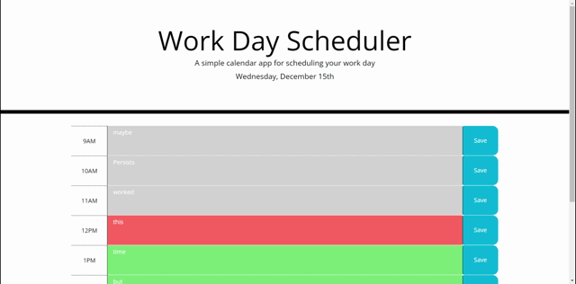

# Work Day Scheduler

## Application Description
 
This application allows a user to enter information into specific hours on a work day shceduler and save that information in that slot. The user is presented with a brief description of what the page is, "a simple calendar app for scheduling your work day," as well as the current date. Hourly time blocks from the hours of 9am to 5pm are given where the user will be able to enter text. The save buttons to the right of each time block will save the text in its respective row, which will persist upon loading the page. Each time block is also color coded based on the current time of day. Green rows are future times, gray rows are past times, and the red row is the current hour.

The following animation demonstrates the application functionality:

- - -
© 2021 Trilogy Education Services, LLC, a 2U, Inc. brand. Confidential and Proprietary. All Rights Reserved.
